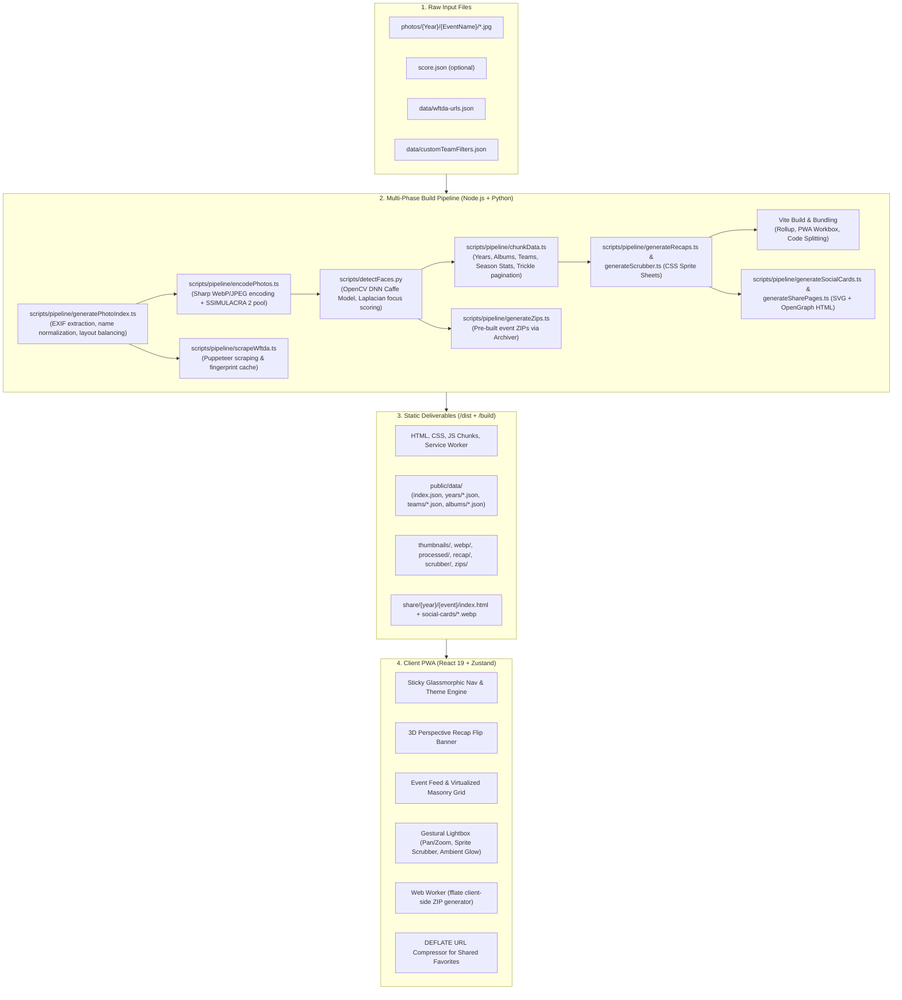

# Photography Portfolio: Architecture, Features & Brainstorming Guide

> **Document Version:** 1.0.0  
> **Target Project:** `photosbyperkins` ([photosbyperkins.com](https://photosbyperkins.com))  
> **Last Updated:** September 2026  

---

## Table of Contents

1. [Executive Summary](#1-executive-summary)
2. [High-Level System Architecture](#2-high-level-system-architecture)
   - [Architecture Diagram](#architecture-diagram)
   - [Core Design Philosophy](#core-design-philosophy)
   - [Technology Stack Matrix](#technology-stack-matrix)
3. [The Multi-Phase Build Pipeline](#3-the-multi-phase-build-pipeline)
   - [Phase 1: Validation & Code Hygiene](#phase-1-validation--code-hygiene)
   - [Phase 2: In-Memory Indexing & Perceptual Encoding](#phase-2-in-memory-indexing--perceptual-encoding)
   - [Phase 3: Python OpenCV DNN Facial Detection & Focus Point Tracking](#phase-3-python-opencv-dnn-facial-detection--focus-point-tracking)
   - [Phase 4: Data Chunking, Team Aggregation & Static ZIP Archives](#phase-4-data-chunking-team-aggregation--static-zip-archives)
   - [Phase 5: Sprite Sheet Generation (Recap & Scrubber)](#phase-5-sprite-sheet-generation-recap--scrubber)
   - [Phase 6: Media Staging & Distribution Ingestion](#phase-6-media-staging--distribution-ingestion)
   - [Phase 7: Vite Compilation, OpenGraph Generation & Social Sharing](#phase-7-vite-compilation-opengraph-generation--social-sharing)
4. [Data Structures & Chunking Mechanics](#4-data-structures--chunking-mechanics)
   - [Hierarchical Data Payloads](#hierarchical-data-payloads)
   - [Trickling & Cache Manifest Strategies](#trickling--cache-manifest-strategies)
5. [Frontend Architecture & User Experience](#5-frontend-architecture--user-experience)
   - [Component Hierarchy](#component-hierarchy)
   - [Global State Management (Zustand)](#global-state-management-zustand)
   - [Virtualization & Rendering Performance](#virtualization--rendering-performance)
   - [Design Tokens & Glassmorphism](#design-tokens--glassmorphism)
6. [Comprehensive Inventory of Existing Features](#6-comprehensive-inventory-of-existing-features)
   - [Automated Computer Vision & Metadata](#automated-computer-vision--metadata)
   - [Dynamic Year Recap Showcase](#dynamic-year-recap-showcase)
   - [Dual-View Portfolio Feed](#dual-view-portfolio-feed)
   - [Next-Gen Lightbox Experience](#next-gen-lightbox-experience)
   - [Favorites Engine & Web Worker Archiver](#favorites-engine--web-worker-archiver)
   - [Database-Free Shareable Favorites (DEFLATE URLs)](#database-free-shareable-favorites-deflate-urls)
   - [Fuzzy Search & Team Discovery](#fuzzy-search--team-discovery)
   - [Sports & WFTDA Integration](#sports--wftda-integration)
   - [PWA & Offline Resilience](#pwa--offline-resilience)
   - [Social Previews & Rich SEO](#social-previews--rich-seo)
   - [Deployment & Operational Tooling](#deployment--operational-tooling)
7. [Feature Brainstorming & Development Roadmap](#7-feature-brainstorming--development-roadmap)
   - [Category 1: Computer Vision & AI Intelligence](#category-1-computer-vision--ai-intelligence)
   - [Category 2: Lightbox & Gallery Interaction](#category-2-lightbox--gallery-interaction)
   - [Category 3: Sports & Tournament Features](#category-3-sports--tournament-features)
   - [Category 4: Social, Client & Athlete Engagement](#category-4-social-client--athlete-engagement)
   - [Category 5: Pipeline, DevEx & Infrastructure](#category-5-pipeline-devex--infrastructure)
8. [Impact vs. Effort Prioritization Matrix](#8-impact-vs-effort-prioritization-matrix)
9. [Conclusion & Next Implementation Steps](#9-conclusion--next-implementation-steps)

---

## 1. Executive Summary

`photosbyperkins` is an automated, high-performance static web application and data pipeline engineered specifically for high-volume action sports photography (primarily roller derby / WFTDA, tournament events, and athletic portraiture). 

Rather than relying on a heavy server runtime, dynamic database queries, or commercial portfolio platforms (e.g., Squarespace, SmugMug, Pixieset), the project operates on a **zero-runtime-backend model**:
1. High-resolution raw photograph directories are parsed through a multi-stage compilation pipeline.
2. The pipeline extracts EXIF metadata, evaluates image sharpness, identifies faces and focal centers via deep neural networks, performs perceptual WebP quality tuning via SSIMULACRA 2, composites CSS sprite sheets, scrapes official tournament scores, and serializes optimized JSON chunks.
3. The client is a standalone Progressive Web App (PWA) built with React 19, TypeScript, and Vite. It renders hardware-accelerated animations, multi-column masonry grids, virtualized infinite scrolling, a gestural lightbox with real-time drag scrubbing, and an offline-capable client-side ZIP archiver.

---

## 2. High-Level System Architecture

### Architecture Diagram



### Core Design Philosophy

- **Zero Database / Zero Dynamic Backend**: The production site is served as pure static files (HTML, JSON, WebP, JS, CSS). It can be hosted on any static file server, Apache/Nginx host (e.g., Bluehost, Netlify, Cloudflare Pages, S3/R2).
- **Perceptual Quality Optimization (SSIMULACRA 2)**: Thumbnails and preview images are not compressed using arbitrary static quality integers (like `quality: 80`). Instead, they are dynamically tested against a worker pool that determines the minimal WebP quality level achieving a target perceptual similarity score, saving bandwidth without introducing visible compression artifacts.
- **Micro-Chunked Data Layer**: Initial page load requires only `index.json` (~200 bytes). Year datasets are split into primary event payloads and background-trickled pagination parts. Individual full albums (~50–300 photos) are fetched on-demand only when an event enters the viewport or the user toggles into grid view.
- **Hardware-Accelerated Fluidity**: Framer Motion powers 60fps/120fps physics-driven gestures: horizontal swiping, spring snaps, ambient color shifts, and 3D card flips with automatic accessibility fallbacks (`prefers-reduced-motion`).

### Technology Stack Matrix

| Layer | Technologies | Primary Purpose |
|---|---|---|
| **Build & Orchestration** | Node.js, `tsx`, TypeScript, Python 3 | Pipeline execution, caching, interop |
| **Image Processing** | `sharp` (libvips), `@nrs-binding/ssimulacra2` | High-throughput resize, format conversion, SSIM testing |
| **Computer Vision** | OpenCV (`cv2.dnn`), Caffe SSD Res10, Laplacian filter | Face detection, focus point coordinates, sharpness scoring |
| **Web Scraping** | Puppeteer (headless Chrome) | WFTDA score and matchup scraping |
| **Frontend Framework** | React 19, TypeScript, Vite 8 | UI components, streaming build, PWA manifest |
| **State & Navigation** | Zustand 5 (with `persist`), React Router 7 | Global UI state, favorites store, route deep-linking |
| **Styling & Effects** | Sass (SCSS), Glassmorphism, CSS Custom Properties | Apple-style blur backdrops, responsive grid, dynamic theming |
| **Animation & Gestures** | Framer Motion 13 | Touch tracking, physics-based springs, carousel scrubbers |
| **Search Engine** | Fuse.js 7 | Client-side typo-tolerant team and tournament search |
| **Compression & Workers**| `fflate`, Web Workers, native `CompressionStream` | Client-side ZIP creation, DEFLATE URL encoding |
| **Quality & Testing** | Playwright (15 E2E test suites), Vitest, ESLint | Automated regression testing, accessibility audits |

---

## 3. The Multi-Phase Build Pipeline

The pipeline is orchestrated by `scripts/build.ts` and broken into distinct phases that maximize CPU parallelism while managing memory utilization:

### Phase 1: Validation & Code Hygiene
- **`npm run clean`**: Cleans prior staging artifacts and temporary build caches.
- **`npm run format`**: Prettier formats all source code to maintain style uniformity.
- **`npx tsc`**: Validates TypeScript typing across both frontend code and pipeline scripts.

### Phase 2: In-Memory Indexing & Perceptual Encoding
- **EXIF Extraction (`generatePhotoIndex.ts`)**:
  - Scans `photos/{Year}/{EventDir}/`.
  - Intelligently parses folder naming conventions (e.g., `03_23 Sacramento Roller Derby Bout I`).
  - Reads EXIF tags (`DateTimeOriginal`, `Model`, `LensModel`, `FocalLength`, `FNumber`, `ExposureTime`, `ISO`).
  - Normalizes camera/lens strings (e.g., cleans Nikkor/Sony noise, detects prime lenses).
  - Sorts photos by capture timestamp.
  - Implements **masonry aspect-ratio balancing**: extracts the last 15 photos in an album and sorts them ascending by aspect ratio to prevent jagged column bottoms in multi-column CSS masonry layouts.
- **Master Encoder (`encodePhotos.ts`) & SSIMULACRA 2 Pool (`ssim2Pool.ts`)**:
  - Encodes 3 tiers of images:
    1. **Thumbnails**: WebP, max dimension 1080px, dynamically compressed via binary search targeting SSIMULACRA 2 score thresholds.
    2. **WebP Display**: WebP, max dimension 3840px (4K), high quality for lightbox view.
    3. **Processed Originals**: MozJPEG progressive JPEGs with trellis quantization and 4:4:4 chroma subsampling for 100% original downloads.
  - Worker pool utilizes `os.cpus().length / 2` threads to parallelize compute-heavy quality calculations.
- **Parallel Scrapers & Assets**:
  - Simultaneously runs `scrapeWftda.ts` using Puppeteer to scrape game scores from `stats.wftda.com`. Employs content-based event fingerprinting (`crypto.createHash('sha1')`) so scrapers skip execution if event names haven't changed.
  - Runs `generateFavicon.ts` to generate multi-size PWA icons from root `icon.svg`.

### Phase 3: Python OpenCV DNN Facial Detection & Focus Point Tracking
- Handed off to `scripts/detectFaces.py` via serialized state in `data/photos.json`.
- Uses a ResNet-10 SSD Caffe neural network (`res10_300x300_ssd_iter_140000.caffemodel`).
- Computes focal center `(focusX, focusY)` for each photograph.
- Measures facial sharpness via the variance of the Laplacian filter (`cv2.Laplacian().var()`).
- Applies a center penalty and area weighting to select the focal subject.
- Computes two distinct scores:
  1. `faceScore`: Lenient score used for lightbox focal panning and selecting the optimal event **Hero photo**.
  2. `recapScore`: Strict score with an exponential multiple-face penalty factor ($total\_faces^4$) and boundary clipping checks, specifically designed for 1:4 aspect ratio vertical recap slices.
- Caches all detections in `data/.faces_cache.json`.

### Phase 4: Data Chunking, Team Aggregation & Static ZIP Archives
- **`generateZips.ts`**: Uses `archiver` to generate pre-packaged event ZIP files in `build/zips/` using Store-only compression (`level: 0`) to minimize build time (images are already compressed).
- **`chunkData.ts`**:
  - Generates `public/data/index.json` containing the list of available years.
  - Generates per-year chunk files (`public/data/years/{year}.json`). If a year exceeds 10 events, it splits into `_part2.json`, `_part3.json` with `nextPart` pointers.
  - Extracts individual album JSON files into `public/data/albums/{year}/{albumSlug}.json`, stripping album arrays from parent year payloads to keep initial bundle sizes tiny.
  - Aggregates team metadata across all years into `public/data/teams/{teamSlug}.json` and `public/data/teams/index.json`.
  - Evaluates `data/customTeamFilters.json` to generate virtual team categories (e.g., Round Robin, Juniors, All-Stars).
  - Computes **Season Statistics**: Total games, total photo count, most photographed teams, first seen teams, most used camera body, most used lens.

### Phase 5: Sprite Sheet Generation (Recap & Scrubber)
- **`generateRecaps.ts`**:
  - Crops top-scoring highlight images to a strict 1:4 vertical aspect ratio (240x960px) centered around detected face focus coordinates.
  - Composites these slices horizontally into a unified WebP sprite sheet per year (`build/recap/{year}/sprite.webp`).
- **`generateScrubber.ts`**:
  - Generates micro-thumbnails (72x48px) cropped around focal coordinates.
  - Stitches every photo in an event into a single horizontal sprite sheet (`build/scrubber/{year}/{albumSlug}/sprite.webp`).
  - This sprite is leveraged in the lightbox for instant, zero-latency drag-scrubbing and dynamic ambient blur backgrounds.

### Phase 6: Media Staging & Distribution Ingestion
- **`processAndCopyPhotos.ts`**: Verifies and moves all finalized assets (`thumbnails`, `webp`, `processed`, `recap`, `scrubber`, `zips`) into the staging structure.

### Phase 7: Vite Compilation, OpenGraph Generation & Social Sharing
- **Vite Production Build**: Compiles React 19 frontend into hashed assets in `dist/assets/`, registers PWA service worker with Workbox caching rules.
- **`generateSocialCards.ts`**: Generates high-resolution branded 1200x630 OpenGraph images (`dist/social-cards/*.webp`) using Sharp SVG composition with album titles, match scores, event dates, custom brand typography, and highlight photo backdrops.
- **`generateSharePages.ts`**: Generates individual static HTML entry points for every album (`dist/share/{year}/{event}/index.html`) containing structured `ImageGallery` JSON-LD schema, OpenGraph tags, and Twitter Cards, redirecting human visitors back into the SPA.
- **`generateSitemap.ts`**: Produces standard XML sitemaps indexing all events and years for search engines.

---

## 4. Data Structures & Chunking Mechanics

### Hierarchical Data Payloads

The architecture separates metadata from image listings to achieve optimal Time to Interactive (TTI):

```
public/data/
├── index.json                  # Top-level index: { "years": ["2026", "2025", ...] }
├── years/
│   ├── 2025.json               # First 10 events + season stats + recap metadata + nextPart
│   ├── 2025_part2.json         # Subsequent events (lazy loaded in background)
│   └── 2024.json
├── albums/
│   └── 2025/
│       ├── 0412-championship.json # Full array of PhotoRecord objects for this specific album
│       └── 0115-bout-one.json
└── teams/
    ├── index.json              # List of all unique teams with event counts & slugs
    ├── sacred-city.json        # Reverse-chronological event records across all seasons
    └── california-all-stars.json
```

### TypeScript Data Contracts

```typescript
// Photo metadata object
export interface PhotoRecord {
    original: string;       // Path to full JPEG: "/photos/2025/event/photo_001.jpg"
    thumb: string;          // Path to WebP thumbnail: "/thumbnails/2025/event/photo_001.webp"
    width?: number;         // Native pixel width
    height?: number;        // Native pixel height
    focusX?: number;        // Normalized X focal coordinate [0.0 - 1.0]
    focusY?: number;        // Normalized Y focal coordinate [0.0 - 1.0]
    spriteIndex?: number;   // Zero-based index within the album's scrubber sprite
    exif?: {
        cameraModel?: string; // e.g. "Nikon ℤ9"
        lens?: string;        // e.g. "70-200mm f/2.8"
        focalLength?: string; // e.g. "135mm"
        aperture?: string;    // e.g. "f/2.8"
        shutterSpeed?: string;// e.g. "1/1000s"
        iso?: string;         // e.g. "ISO 3200"
        isPrime?: boolean;
    };
}

// Event metadata object
export interface EventData {
    album: PhotoRecord[];         // Populated when album JSON is fetched
    highlights: PhotoRecord[];    // 5 curated highlight photos (always present in year chunk)
    date?: string | null;         // Formatted date string
    description?: string | null;  // Editorial description
    zip?: string;                 // Path to download zip: "/zips/2025_Event_Name.zip"
    photoCount?: number;          // Total photos in full album
    albumSlug?: string;           // URL slug
    originalYear?: string;        // In team views, indicates originating year
    wftdaMatch?: WftdaMatch;      // Official match score & opponents
    localScore?: EventScore;      // Overridden score from local score.json
}
```

### Trickling & Cache Manifest Strategies

1. **Recap-Gated Trickle Loading**: In `src/hooks/usePortfolioData.ts`, secondary event chunks (`_part2.json`) and background year prefetching are intentionally suspended until the animated Recap sprite finishes loading and mounting. This ensures network bandwidth is 100% dedicated to above-the-fold visual assets.
2. **Session Memory Cache**: A module-level memory cache (`yearDataCache`) stores fetched year payloads so switching back and forth between year tabs is instant and issues zero HTTP requests.

---

## 5. Frontend Architecture & User Experience

### Component Hierarchy

```
App.tsx
├── Nav.tsx (Sticky glassmorphic bar + ThemeToggle + Portal Target)
│   └── [Portal: Year / Team Filter Nav Links]
├── Portfolio/index.tsx (Main orchestrator)
│   ├── Recap.tsx (3D flipping slice banner + Season stats strip)
│   ├── SharedFavoritesPanel.tsx (Floating drawer for incoming shared links)
│   ├── PortfolioEvent.tsx (Event card)
│   │   ├── PortfolioEventTitle.tsx (Match title, team vs tags, live score)
│   │   ├── Action Controls (Zip download, Share, Featured/Grid segmented switch)
│   │   ├── Featured Strip (5 curated photos with +N overlay)
│   │   └── Full Album Display
│   │       ├── VirtualizedAlbumGrid.tsx (react-window for >50 photos)
│   │       └── Standard Grid (CSS masonry for smaller albums)
│   ├── GlobalSearchOverlay.tsx (Fuse.js team search modal)
│   └── LightboxContainer.tsx -> Lightbox.tsx (Fullscreen portal)
│       ├── LightboxAmbient.tsx (Dynamic background blur from sprite frames)
│       ├── LightboxHeader.tsx (Event title, EXIF specs badge, shortcuts help)
│       ├── LightboxSlide.tsx (Pan, double-tap zoom to 100%, swipe tracking)
│       └── LightboxScrubber.tsx (Interactive horizontal sprite drag track)
├── Footer.tsx (Copyright, CC BY-SA license badge, social links)
├── PwaStatusToast.tsx (Offline indicator)
└── About.tsx (Photographer bio overlay + gear list + profile photo)
```

### Global State Management (Zustand)

The store (`src/store/useAppStore.ts`) uses Zustand with persistence middleware:
- **`theme`**: `'light' | 'dark' | 'system'` (persisted to LocalStorage). Automatically detects system color scheme changes via `window.matchMedia`.
- **`favorites`**: Array of starred photo items (persisted to LocalStorage).
- **`lightbox`**: State storing active images array, current photo index, event name, year, and max EXIF character width.
- **`sharedPhoto`**: Target photo passed via deep links or recap slice clicks to auto-open the lightbox.
- **`isAboutOpen` / `iframeUrl`**: Modal visibility flags.

### Virtualization & Rendering Performance

- **Dynamic Virtualization Threshold**: Configurable via `VITE_VIRTUAL_GRID_THRESHOLD` (defaults to 50 photos). Albums with fewer than 50 photos render a standard CSS grid. Albums with 50+ photos automatically mount `VirtualizedAlbumGrid.tsx` powered by `react-window`.
- **Window Scroll Synchronization**: `VirtualizedAlbumGrid` binds to the main window's scroll events rather than creating an internal nested scroll container, preserving natural mobile gestures and browser address bar behaviors.
- **Progressive Image Loading**: `ProgressiveImage.tsx` leverages native browser lazy loading (`loading="lazy"`), smooth opacity transitions on load, and focal coordinate object positioning (`objectPosition: focusX% focusY%`).

### Design Tokens & Glassmorphism

Implemented in `src/styles/_globals.scss`:
- **Backdrop Filters**: `-webkit-backdrop-filter: blur(20px) saturate(180%)` provides iOS/macOS style frosted glass headers and overlays.
- **Typography**: Display/Headings in `Barlow Condensed` (high impact, athletic), body text in `Outfit` (clean geometric sans-serif).
- **Z-Index Layering Tokens**: Strictly structured from `--z-base: 1` through `--z-lightbox: 9000` to `--z-modal: 9999` to guarantee predictable overlay stacking.

---

## 6. Comprehensive Inventory of Existing Features

### Automated Computer Vision & Metadata
- **Deep Neural Network Face Detection**: Automated identification of human faces using OpenCV Caffe SSD with Laplacian sharpness filtering.
- **Focal Point Auto-Cropping**: Computes optimal `(focusX, focusY)` coordinates so 3:2 landscape photos crop intelligently to square grid thumbnails and vertical recap banners without slicing heads.
- **Hero Image Auto-Selection**: Evaluates facial confidence, sharpness, and framing across all photos in an event to pick the single most striking hero shot.
- **EXIF Extraction & Sanitization**: Parses lens and camera data, standardizes model names, formats exposure/aperture/ISO, and determines prime vs. zoom lenses.
- **Perceptual Image Compression**: Uses SSIMULACRA 2 score algorithms in a worker pool to optimize WebP thumbnails to the exact threshold of human visual transparency.

### Dynamic Year Recap Showcase
- **Animated 3D Flip Banners**: Horizontal banner constructed of vertical 1:4 slices that flip in with staggered 3D perspective rotations.
- **Responsive Slicing**: Dynamically computes optimal slice counts based on window width (from 6 to 48 slices) with sprite sheet coordinate mapping.
- **Interactive Slice Navigation**: Clicking any slice directly opens the lightbox to that exact photograph, keeping the background scroll position intact.
- **Season Statistics Strip**: Summarizes games photographed, total photos shot, most-encountered opponent teams, newly discovered teams ("First Seen"), favorite camera body, and favorite lens.

### Dual-View Portfolio Feed
- **Reverse Chronological Feed**: Groups shoots by season, with chronological/reverse-chronological ordering based on exact match dates.
- **Featured 5-Photo Strip**: Default compact view highlighting the top 5 shots, with a mobile-optimized `+N` badge displaying remaining photo counts.
- **Full Album Grid View**: Seamless segmented switch to view every photograph in the shoot.
- **Virtualized Grid Support**: Automatic transition to `react-window` virtualization for huge albums (>50 photos) to preserve DOM performance and low memory footprints.
- **Event Score & Match Badges**: Displays opponent matchup badges, final scores, and winner highlights based on WFTDA data or local `score.json`.

### Next-Gen Lightbox Experience
- **Touch & Gesture Physics**: Drag-to-dismiss and horizontal swipe navigation with spring dynamics powered by Framer Motion.
- **Focal Point Double-Tap Zoom**: Double-tap (or keyboard `Z`) zooms directly to 100% natural pixel resolution centered on the detected face/subject, followed by constrained panning.
- **Real-Time Sprite Scrubber**: Dragging across the photo slides an interactive 72x48 sprite track at the bottom of the screen, providing instant visual feedback.
- **Dynamic Ambient Blur Glow**: A blurred, saturated glow in the background shifts colors to match the dominant tones of the active photo, powered directly by preloaded sprite frames.
- **Single-Tap Theater Mode**: Hides all overlays, headers, and scrubbers for immersive photo viewing.
- **Comprehensive Keyboard Shortcuts**:
  - `←` / `→` or `Space`: Navigate photos
  - `F` / `L`: Toggle favorite
  - `Z`: Toggle 100% zoom
  - `T`: Toggle theater mode
  - `D`: Direct download of the full-resolution original
  - `Esc`: Close lightbox
  - `?`: Open keyboard shortcut cheatsheet modal
- **Predictive Nearest-Neighbor Preloader**: Silently preloads display-resolution WebP images of adjacent photos in the background so swiping is instantaneous.

### Favorites Engine & Web Worker Archiver
- **Instant Star / Favorite**: Users can star any photo in the lightbox or grid.
- **Persistent Favorites Collection**: Stored in LocalStorage via Zustand, surviving browser restarts.
- **Dedicated Favorites Tab**: Access all starred photos across all years in a unified gallery.
- **Client-Side Background ZIP Archiving**: Downloads all starred photos into a single `.zip` file entirely in the browser using `fflate` inside a dedicated Web Worker, complete with a real-time progress bar.

### Database-Free Shareable Favorites (DEFLATE URLs)
- **Compact URL Encoding**: Compresses an entire list of favorite photo references across multiple albums into a single lightweight URL.
- **DEFLATE + Base64URL**: Uses native browser `CompressionStream` to group photos by `year/albumSlug:num1,num2` and compress them into short `2.<payload>` URL fragments.
- **Shared Favorites Panel**: Opening a shared link renders an interactive overlay letting the recipient view the curated collection, add all photos to their personal favorites with one click, or download them as a ZIP.

### Fuzzy Search & Team Discovery
- **Typo-Tolerant Search (`Fuse.js`)**: Instant client-side search across hundreds of team names and tournament slugs.
- **Dedicated Team Portfolio Views**: `/portfolio/team/:slug` renders all historic games for a given league/team across all seasons, separated by clean year divider badges.
- **Dual Sorting Modes**: Toggle search results alphabetically (A–Z) or by total photographed games (9–1).
- **Custom Rule Filters**: Configurable matching rules in `data/customTeamFilters.json` to create virtual category feeds (e.g., Round Robins, Junior Derby).

### Sports & WFTDA Integration
- **Automated Score Scraping**: Headless Puppeteer integration scraping `stats.wftda.com` for official game scores, tournament rankings, and match links.
- **Intelligent Name Mapping**: Derives teams and dates from folder names (e.g., `04_12 Team A vs Team B`), matching against official league records.
- **Configurable Team Abbreviations**: JSON mapping via `.env` to convert lengthy league titles (e.g., "Sacramento Roller Derby" → "SRD") for compact mobile headers.

### PWA & Offline Resilience
- **Offline PWA Support**: Service worker registered via Vite PWA / Workbox with aggressive caching for JSON data (`NetworkFirst`) and media assets (`CacheFirst`).
- **Connection Status Toast**: Detects offline/online transitions and alerts the user with a sleek toast notification.
- **Installable Desktop/Mobile App**: Web app manifest with custom icons and app shortcuts (e.g., direct jump to Search).

### Social Previews & Rich SEO
- **Branded OpenGraph Cards**: Automated build generation of 1200x630 social preview images per event, styled with custom branding, match scores, and photo crops.
- **Share Landing Pages**: Standalone HTML pages (`/share/{year}/{event}`) with OpenGraph, Twitter Cards, and `ImageGallery` JSON-LD schema for social scrapers (Facebook, Discord, iMessage, Twitter).
- **Automated XML Sitemap**: Generated on every build.

### Deployment & Operational Tooling
- **Incremental Delta Deployment (`deploy.ts`)**: Remote SSH querying skips previously uploaded static UI assets to complete code deployments in seconds.
- **Delta Media Sync (`syncMedia.ts`)**: Standalone delta sync tool for large media directories (`thumbnails/`, `webp/`, `zips/`, `scrubber/`, `recap/`), uploading in batches of 50 via SCP.
- **Automated Folder Renamer (`renamePhotoFolders.ts`)**: Standardizes shoot directories (`Album` / `Resize` → `resized`, `IG` / `Instagram` → `instagram`).
- **Score Stub Generator (`populateEventScores.ts`)**: Auto-creates `score.json` stubs across all event folders.
- **Build Benchmarking (`benchmark.ts`)**: Clears caches, executes full build, and tracks duration regressions across runs in `.benchmark_results.json` and `data/build_stats.json`.

---

## 7. Feature Brainstorming & Development Roadmap

Using our deep analysis of the pipeline, data layer, and frontend components, here is a categorized brainstorming of high-impact features for future development:

### Category 1: Computer Vision & AI Intelligence

#### 1.1 Athlete Jersey / Roster Number Recognition (OCR)
- **Concept**: Use a lightweight OCR model (e.g., EasyOCR or a fine-tuned MobileNet-SSD) during Phase 3 of the build to detect jersey numbers on skater uniforms and helmets.
- **Why it matters**: In roller derby and action sports, athletes rarely have identifiable facial expressions due to mouthguards, helmets, and motion blur, but jersey numbers are prominent.
- **Implementation**:
  - Run OCR bounding box detection on torso/helmet crops in Python.
  - Store detected numbers in `photo.tags = ["#12", "#404"]`.
  - Add number searching to `GlobalSearchOverlay.tsx` (e.g., searching "12" or "SRD 12" instantly filters photos showing that athlete).

#### 1.2 Unsupervised Athlete Face / Person Clustering
- **Concept**: Generate face embeddings using a lightweight model (e.g., FaceNet or InsightFace Mobile) and cluster photos belonging to the same recurring person across multiple games.
- **Why it matters**: Creates automated "Skater Spotlight" profiles where athletes can find all photos of themselves across 5+ seasons without manual tagging.
- **Implementation**:
  - Compute a 128-d or 512-d vector per detected face during Python build.
  - Run DBSCAN or k-means clustering to group recurring faces into anonymous `Athlete_01`, `Athlete_02` IDs.
  - Provide an optional config file (`athletes.json`) mapping IDs to skater names.

#### 1.3 Peak Action & Emotion Detection
- **Concept**: Score images based on dynamic action (motion blur vs. subject sharpness, airborne jumps, apex blocks, falls, bench celebrations).
- **Implementation**:
  - Evaluate optical flow and edge complexity in OpenCV.
  - Use high-action scores to sort the featured 5-photo highlights instead of purely random or chronological selection.

#### 1.4 Next-Gen Image Compression: AVIF & JPEG XL
- **Concept**: Augment the master encoder with AVIF encoding alongside WebP.
- **Why it matters**: AVIF yields ~20–30% better compression efficiency over WebP at equivalent SSIM scores, dramatically reducing bandwidth for high-resolution 4K lightbox displays.
- **Implementation**: Sharp natively supports `.avif()`. Generate AVIF versions during Phase 2 and serve via `<picture>` tags or content negotiation.

---

### Category 2: Lightbox & Gallery Interaction

#### 2.1 Burst Shot Comparison Mode
- **Concept**: In action photography, photographers frequently capture 10–20fps burst sequences. Allow users to compare consecutive burst shots side-by-side or with an interactive split-slider in the lightbox.
- **Implementation**:
  - Pipeline detects bursts based on EXIF `DateTimeOriginal` timestamps within 1–2 seconds of each other.
  - Mark photos as burst clusters (`photo.burstGroupId = "..."`).
  - Lightbox displays a "Compare Burst" button that opens a side-by-side dual canvas or rapid-diff scrubber.

#### 2.2 Interactive EXIF Gear Explorer & Photography Insights
- **Concept**: A dedicated photography portfolio page (`/gear` or `/insights`) that aggregates camera and lens metadata across the photographer's entire career.
- **Features**:
  - Interactive charts showing focal length distribution (e.g., % of shots taken at 70mm vs 200mm).
  - Shutter speed vs ISO breakdown in low-light roller derby venues.
  - Ability to filter the portfolio by gear: "Show all photos shot on the 85mm f/1.4" or "Show shots taken at 1/1250s".

#### 2.3 Automated Slideshow Mode with Custom Tempo
- **Concept**: A hands-free presentation mode in the lightbox for team banquet presentations, TV displays in arenas, or portfolio reviews.
- **Implementation**:
  - Pressing `S` in the lightbox toggles an automated loop with configurable pacing (3s, 5s, 8s).
  - Smooth pan/zoom (Ken Burns effect) across detected face focus coordinates.

#### 2.4 Multi-Photo Selection & Batch Actions
- **Concept**: Allow users in grid view to enter "Select Mode" to select multiple photos via checkboxes or shift-clicking.
- **Actions**:
  - Batch Add to Favorites.
  - Batch Download Selected Photos (.zip).
  - Generate a temporary share URL for the custom selection.

---

### Category 3: Sports & Tournament Features

#### 3.1 Tournament Bracket & Championship Standings View
- **Concept**: Group individual weekend games into a unified Tournament structure (e.g., "WFTDA Global Playoffs", "RollerCon", "State Championships").
- **Features**:
  - Visual tournament bracket showing quarterfinals, semifinals, and finals.
  - Clicking any match in the bracket navigates directly to that shoot's photo gallery with live scores.

#### 3.2 Chronological Game Timeline (Jam-by-Jam Photo Mapping)
- **Concept**: For games with recorded timestamps, display a horizontal period/jam timeline scrub bar above the event photos.
- **Implementation**:
  - Normalizes EXIF timestamps against game start time (First Half, Halftime, Second Half).
  - Visitors can jump directly to "Late Game / Final Jams" to view high-stakes game-ending action shots.

#### 3.3 Team Roster & Bout Roster Card
- **Concept**: Integrate team rosters with jersey numbers, skater names, and penalty box staff alongside the photo grid.
- **Implementation**:
  - Store roster lists in event folders (`roster.json`).
  - Render an interactive roster drawer in `PortfolioEventTitle.tsx`. Clicking a skater highlights all photos tagged with their number.

---

### Category 4: Social, Client & Athlete Engagement

#### 4.1 "Story / Reel" Card Generator for Instagram & TikTok
- **Concept**: Allow visitors (especially athletes) to export any photo directly into a formatted 9:16 vertical card ready for Instagram Stories.
- **Features**:
  - Client-side Canvas/SVG rendering.
  - Formatted with event title, team matchup score badge, date, and photographer credit tag (`@photosbyperkins`).
  - Centered cleanly on the athlete using the precomputed focal coordinate.

#### 4.2 Instant Arena QR Code Generator
- **Concept**: A pipeline utility or admin view generating QR code cards for printed flyers or arena scoreboards.
- **Features**:
  - Deep-links directly to the specific match: `photosbyperkins.com/portfolio/2026/0412-srd-vs-bcr`.
  - Allows attendees and skaters to scan their phone at the bout and immediately view uploaded photos.

#### 4.3 High-Resolution Client Proofing / Watermark Toggle
- **Concept**: Provide an optional client proofing mode for paid shoots or commercial clients.
- **Implementation**:
  - Support watermarked preview thumbnails on public views.
  - Entering a client passcode in `useAppStore` un-watermarks the view and enables uncompressed original downloads.

---

### Category 5: Pipeline, DevEx & Infrastructure

#### 5.1 Local TUI / Web Admin Review Dashboard
- **Concept**: A lightweight local terminal UI (or local web portal at `localhost:3333`) to inspect build artifacts before deploying.
- **Capabilities**:
  - Visually verify detected face bounding boxes and adjust focal centers with a single click.
  - Edit or verify `score.json` stubs visually.
  - Review SSIMULACRA 2 compression metrics and file size savings.

#### 5.2 Hot-Reloading Watch Pipeline for Live Shooting (`dev:watch`)
- **Concept**: During live tournaments, allow the photographer to plug in an SD card and have newly added photos automatically indexed, compressed, and hot-reloaded into the local dev server in real-time.
- **Implementation**:
  - `chokidar` watcher monitoring `photos/` for new file additions.
  - Runs incremental indexing and encoding only on new files.

#### 5.3 Multi-Cloud Storage Provider Adapter (S3 / Cloudflare R2 / Backblaze B2)
- **Concept**: Add first-class support for deploying media directories to S3-compatible cloud object storage in addition to SSH/SFTP (Bluehost).
- **Benefits**:
  - Unlimited scalable storage for multi-terabyte photo catalogs.
  - Global edge CDN caching via Cloudflare CDN or AWS CloudFront.
  - Keeps git and local repositories ultra-lean.

#### 5.4 Embedded Copyright & IPTC Metadata Injection
- **Concept**: Ensure all processed JPEGs and WebP exports retain embedded IPTC/XMP copyright, creator credits, website URL, and Creative Commons licensing tags even after resizing.

---

## 8. Impact vs. Effort Prioritization Matrix

| Feature | Impact | Effort | Architectural Feasibility | Recommended Priority |
|---|---|---|---|---|
| **Athlete Jersey Number Recognition (OCR)** | High | Medium | High (Python build pipeline extension) | **P1 (Immediate)** |
| **Instagram Story / 9:16 Export Generator** | High | Low | Very High (Client-side HTML5 Canvas) | **P1 (Immediate)** |
| **Interactive Gear & EXIF Insights (`/gear`)** | Medium | Low | Very High (Data already extracted in `chunkData`) | **P1 (Immediate)** |
| **Multi-Photo Select & Batch Download** | High | Medium | High (Integrates with existing `zipWorker`) | **P2 (Near-Term)** |
| **Burst Shot Comparison Mode** | High | Medium | High (Uses EXIF timestamps + Lightbox slide) | **P2 (Near-Term)** |
| **Tournament Bracket & Standings View** | High | Medium | Medium (Requires tournament schema) | **P2 (Near-Term)** |
| **AVIF Next-Gen Image Format Support** | Medium | Low | High (Sharp natively supports AVIF) | **P2 (Near-Term)** |
| **Slideshow Mode (with Ken Burns focal pans)**| Medium | Low | High (Framer Motion + Lightbox timer) | **P2 (Near-Term)** |
| **S3 / Cloudflare R2 Media Sync Provider** | High | Medium | High (AWS SDK / S3 client in TS script) | **P3 (Future)** |
| **Athlete Face Clustering (Auto-Spotlights)** | Very High| High | Medium (Python vector embedding compute) | **P3 (Future)** |
| **Live Shoot Ingestion Watch Mode** | Medium | Medium | Medium (Chokidar + incremental indexer) | **P3 (Future)** |

---

## 9. Conclusion & Next Implementation Steps

The `photosbyperkins` architecture represents a masterclass in static site performance engineering: combining deep learning computer vision, perceptual quality modeling, and zero-runtime serverless architecture to deliver a desktop-class photography browsing experience.

### Recommended Next Steps
1. **Implement Feature 4.1 (Story / Reel 9:16 Card Export)**: High viral value for athletes sharing photos on social media, requires only client-side Canvas work with existing focal points.
2. **Implement Feature 1.1 (Jersey Number OCR)**: Dramatically improves searchability for action sports where traditional tagging is time-prohibitive.
3. **Implement Feature 2.2 (Photography Gear Insights)**: Turns existing rich EXIF data into an engaging portfolio asset for photography enthusiasts.
